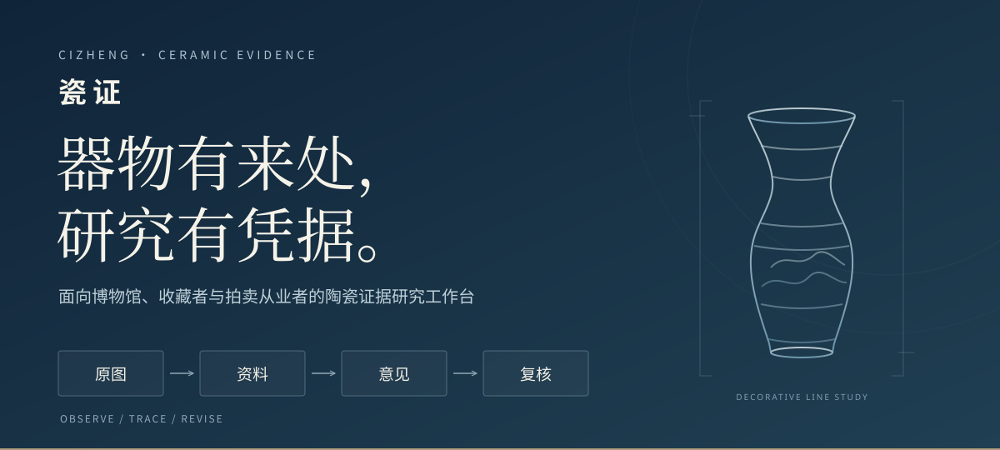
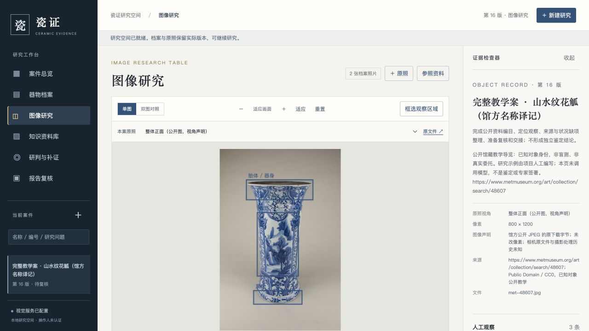
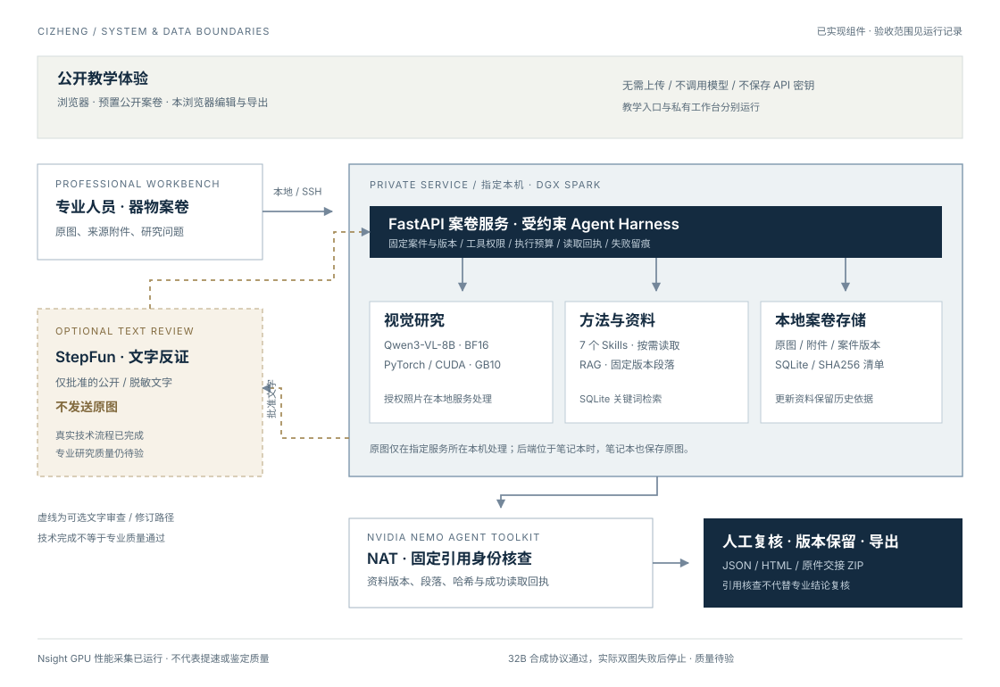

<h1 align="center">瓷证 CIZHENG</h1>
<p align="center"><strong>器物有来处，研究有凭据。</strong><br>面向博物馆、收藏者与拍卖从业者的陶瓷证据研究工作台</p>
<p align="center"><a href="https://dingyucanada.github.io/cizheng-agent-skills/">产品主页</a> · <a href="https://dingyucanada.github.io/cizheng-agent-skills/demo.html">免上传完整体验</a> · <a href="docs/user-guide.md">使用手册</a> · <a href="https://github.com/dingyucanada/cizheng-agent-skills/releases">版本与下载</a></p>

把器物原图、观察记录、来源凭据、专业资料和研究意见，组织成能够回到原始证据的案卷。先观察和定位，再查资料并提出竞争解释，补证后比较版本，由人工复核并导出。瓷证让研究者看清一项意见从哪里来、缺少什么，以及为什么改变。

**立即试用：** [公开教学体验](https://dingyucanada.github.io/cizheng-agent-skills/demo.html)预置三套完整案卷，无需注册或上传。支持实际编辑、证据定位、补证比较、复核与导出；材料使用真实公开馆藏图像，研究示例由项目编写，**此网页不调用 AI 模型**。



*专业工作台真实界面 · v0.6 · 公开教学案。截图展示图像研究功能，不作为模型研究质量证明。*

[观看教学演示 · 2:43 MP4](https://dingyucanada.github.io/cizheng-agent-skills/assets/cizheng-demo-v07.mp4) · [真实 AI 记录回放 · 1:20 MP4](site/assets/cizheng-ai-replay-v07.mp4) · [下载产品与架构介绍 · 10 页 PPTX](site/assets/cizheng-pitch-v07.pptx) · [阅读开发纪实](https://dingyucanada.github.io/cizheng-agent-skills/story.html)

教学演示与主回放均为静音中文字幕。2:43 演示展示预置教学操作，未调用模型；1:20 回放根据第 12 轮真实保存记录制作，展示初稿、批准文字审查、本地修订、NAT 与两版导出完成，**专业质量仍未通过**。回放不是连续屏幕录制或专家验收；来源见 [回放记录清单](site/assets/cizheng-ai-replay-v07.json)。[第 11 轮修订失败回放](site/assets/cizheng-ai-replay-round11-v07.mp4)和 [原来源清单](site/assets/cizheng-ai-replay-round11-v07.json)保留为历史归档。

## 为三种研究工作提供同一条证据链

| 使用场景 | 从材料到交接 | 可操作教学案 |
|---|---|---|
| 博物馆编目与研究 | 登记馆藏 → 定位观察 → 文献参照 → 材料复核 | [山水纹花觚](https://dingyucanada.github.io/cizheng-agent-skills/demo.html?case=met-48607) |
| 收藏档案与来源 | 器物建档 → 来源凭据 → 缺项补证 → 案卷交接 | [青花镂空茶壶](https://dingyucanada.github.io/cizheng-agent-skills/demo.html?case=met-51185) |
| 拍卖图录准备 | 核对描述 → 归属依据 → 措辞订正 → 报告导出 | [五彩耕织图瓶](https://dingyucanada.github.io/cizheng-agent-skills/demo.html?case=met-50839) |

三件样例来自 Met Open Access，馆藏身份已知，业务角色用于教学。它们不是实际委托或鉴定盲测，不能用于宣称未知器物鉴定准确率。

## 不上传材料，也能走完整个过程

1. **打开案卷。** 照片、档案、来源和研究问题已准备好。
2. **定位证据。** 编辑自己的观察，点击事项回到原图区域或文字段落。
3. **阅读方法。** 查看实际 Skill，核对支持、冲突与证据缺口。
4. **补证与比较。** 纳入预置材料，比较记录和意见具体改了什么。
5. **复核与导出。** 留下人工备注，下载报告、原图和 SHA256 文件清单。

访客修改保存在本浏览器。导出保留教学标记，说明预写示例与访客修改；浏览器备注不是可信专家签名。见 [公开体验范围](docs/public-experience.md)。

## 系统架构与材料边界



专业工作台将视觉处理、方法执行与案卷存储放在指定本机 / DGX Spark，笔记本可通过 SSH 隧道访问。原图在服务所在本机保存和处理；后端位于笔记本时，笔记本也保存原图。只有批准的公开或脱敏文字，才进入可选外部文字审查。

| 组件 | 在瓷证中的职责 | 当前范围 |
|---|---|---|
| DGX Spark / GB10 · Qwen3-VL-8B | 在本地处理授权照片与区域像素 | PyTorch / CUDA / BF16 实际运行；当前服务与逐调用证据单独绑定，研究质量仍待验 |
| FastAPI / SQLite / 原始文件 | 案件、权限、版本、附件与交接 | 原件保留、固定资料版本、幂等动作与导出已实现 |
| 7 个领域 Skills / RAG | 按需读取方法与可定位资料 | 自研 Markdown 方法包；SQLite 关键词检索，25 条原创来源摘要 |
| NVIDIA NeMo Agent Toolkit | 核对所选报告的引用身份 | 资料版本、段落、哈希与成功读取回执；软件合同已有真实运行 |
| StepFun · step-3.7-flash | 可选的文字反证审查 | 第 06、09、11、12 轮有真实批准文字审查成功记录；只发批准文字，不发送原图 |
| NVIDIA Nsight Systems | 限定视觉生成区间的 GPU 性能采集 | 已实际采集第 03 轮首次双图观察；不是提速或模型质量结论 |
| 人工复核 | 检查意见、补证和交接范围 | 保留旧版本、备注及原件清单；当前没有可信专家签署 |

第 12 轮已实际完成初稿、一次批准文字审查、本地修订、两版 NAT 核查和两版各三格式导出；两版均实际读取正文并保留一条来源上下文引用，14 次原生请求与业务事件逐条对应。**技术流程完成，专业质量仍未通过**：初稿有同器来源身份错误，修订的风格依据和三项未解决疑点理由仍薄弱，尚未经专家核验。引用身份和结构正确不能替代研究判断。当前局限与此前失败见 [第 12 轮质量记录](verification/nvidia/v07-workflows/round-12/quality-limitations-audit.json)、[逐轮运行证据](verification/nvidia/v07-workflows/README.md)、[当前状态](STATUS.md) 与 [系统架构](docs/nvidia-architecture.md)。

32B 官方权重完整性、CUDA/BF16 热身与合成协议已验证，真实双图业务失败后已停止候选，继续保留权重和失败记录；不能声称更准或已采用。官方 NVIDIA vLLM 镜像拉取未完成、未部署；NIM 中国区官方分发限制阻止下载。TensorRT-LLM、Dynamo 与 NeMo Retriever 未部署。见 [服务与优化选择](docs/model-serving-options.md) 和 [更大模型候选](docs/larger-model-candidates.md)。

## Skills：把研究方法变成下一步

例如山水纹花觚的青花比较研究：先分列可见器形、装饰、照片覆盖与馆方记载；读取实际资料段落，列出相符线索、反例和竞争解释；新增同器照片后，逐项说明哪些观察改变、哪些归属仍需补证。风格相近本身不足以推出制作时期或真伪。

| Skill | 具体方法 |
|---|---|
| [任务与补拍路由](skills/ceramic-route/SKILL.md) | 确认任务，检查输入质量与缺失部位，确定下一项材料 |
| [陶瓷编目研究](skills/ceramic-research-record/SKILL.md) | 分开对象登记、可见观察、资料记载与归属主张 |
| [青花比较研究](skills/bluewhite-attribution-test/SKILL.md) | 核对相似、反例与竞争解释，保留证据限制 |
| [状况竞争解释](skills/condition-hypothesis-test/SKILL.md) | 区分照片现象、状况假说与实际检查记录 |
| [来源经历核查](skills/provenance-evidence-audit/SKILL.md) | 核对来源事件、同器联系与原始凭据，保留经历缺口 |
| [文字凭据核查](skills/documentary-evidence-audit/SKILL.md) | 读取本案许可文字，分列相符、冲突、缺失与需复核 |
| [补证与版本修订](skills/evidence-revise/SKILL.md) | 比较新旧主张与依据，保留历史意见、失败和未解决项 |

方法以描述 → 正文 → 按需参考资源渐进加载，整包 SHA256 固定实际采用的版本。工具执行、权限、读取回执和预算由宿主约束。七个领域方法为项目自研，未获得 NVIDIA Verified、专家签署或专业准确率认证；专业效果需独立专家样本的有 / 无 Skills 对照。

RAG 提供 25 条项目原创来源摘要，注明机构链接、适用范围、权利与局限，专业准确性待专家核查。后端使用 SQLite 与中文关键词索引；文字匹配分不表示证据可信度。引用必须绑定实际读到的资料版本、段落与定位，知识库更新保留旧案依据。见 [资料库](https://dingyucanada.github.io/cizheng-agent-skills/knowledge.html) 与 [中文来源核查](docs/chinese-source-audit.md)。

## 本地专业工作台

要求 Python 3.11+。以下命令建立环境、导入教学材料并启动服务。`requirements-tested.txt` 固定实际测试依赖，`requirements.txt` 保留兼容范围。

```bash
git clone https://github.com/dingyucanada/cizheng-agent-skills.git
cd cizheng-agent-skills
python3.11 -m venv .venv
source .venv/bin/activate
pip install -r requirements-tested.txt
python -m cizheng.demo --guided --data-dir ./data
python -m uvicorn cizheng.api:create_app --factory --host 127.0.0.1 --port 8780
```

浏览器打开 `http://127.0.0.1:8780`。教学材料可重复导入，不覆盖后续人工修改，不请求模型。真实 AI 研究需另行配置视觉服务，见 [Spark 部署与验收](docs/spark-validation.md)、[模型选择](docs/model-selection.md) 与 [NVIDIA 集成复现](docs/nvidia-integration.md)。

| 工作区 | 可以完成的工作 |
|---|---|
| 案件总览 | 选择业务任务，查看准备度与下一项工作 |
| 器物档案 | 记录尺寸、款识、来源、状况检查和对应附件 |
| 图像研究 | 原图、双图、缩放、局部框选与人工观察；档案最多 30 图，本轮选 1–8 图 |
| 知识资料库 | 中文关键词检索，查看出处与段落，固定本案资料版本 |
| 研判与补证 | 配置模型后执行有预算的工具流程，保存主张与修订历史 |
| 报告复核 | 逐图观察、支持与冲突、分项理由及待补证；固定引用核查与 JSON / Markdown / HTML / ZIP 导出 |

没有模型时，材料登记、图像操作、资料检索、准备复核和离线导出仍可用。文字凭据任务只核对本案许可 UTF-8 TXT 与固定资料段落，不作视觉归属；PDF 当前保留原文件和定位，不自动 OCR。

## 验证与复现

```bash
pip install -r requirements-structured-tested.txt
PYTHONDONTWRITEBYTECODE=1 python -m pytest -q -p no:cacheprovider tests integrations/spark_transformers/tests
python scripts/build-public-site.py
npm ci --ignore-scripts
npm run test:web
```

已实测的 Spark ARM64 r15 工程回归为 **913 passed / 8 skipped / 1 warning，309.15 秒**；专项为 403 passed / 6 skipped / 1 warning，143.49 秒。原生生产服务仍为 r11；包含 8 项新增阶段 Schema 的原生测试在 r14 实测 147 passed / 1 warning，4.54 秒，生产代码与 r15 相同。这些工程检查均为 0 次 GPU 模型请求；公开核心、集成与测试 Python 文件另与实际 r15 部署清单逐 SHA 核对 86/86，范围不包含整个 Git 仓库。见 [工程记录](verification/nvidia/v07-workflows/engineering-checks-v07.json) 和 [源码一致性](verification/nvidia/v07-workflows/runtime-public-python-parity.json)。

工程检查覆盖原件保留、跨案权限、资料版本、读取回执、预算、修订和导出。纯色图、脚本模型和模拟网络只用于软件合同，不衡量陶瓷鉴定能力。专家材料仍在另一台电脑，尚未接收验证或校准真品率；接入字段与盲评流程见 [专家验证接入](docs/expert-validation-intake.md)。专业比较应固定模型、资料与预算，保留失败；少量个案不能推出行业准确率。

[评测协议](evals/PROTOCOL.md) · [评测口径](BENCHMARK.md) · [专家材料接入](docs/expert-intake.md) · [报告与数字口径](docs/authenticity-and-scoring.md) · [受控工作流](docs/controlled-workflow.md)

## 仓库导航

```text
cizheng/              案卷服务、工具、资料库、模型与评测适配
static/               本地专业工作台界面
site/                 产品主页与免上传教学体验
skills/               七个方法包及参考资源
knowledge/            原创来源摘要与出处
examples/public-demo/ 公开馆藏图像、许可和教学材料
integrations/         NAT 插件与 Spark GPU 适配器
deploy/               本地与 Spark 环境、启动及配置
docs/                 产品、使用、架构、部署与权利说明
verification/         已执行的运行证据及失败记录
evals/ tests/          专业评测协议与工程检查
```

## 适用范围与许可

当前提供单人受控试用，尚未实现机构多用户授权、可信专家签署、实物检测、价格评估或产权审批。**采集覆盖指数**仅反映本轮照片所标注的整体、底足、口沿、釉面和纹饰覆盖；真品概率保持“待校准”。研究报告用于继续研究与人工复核，不是自动鉴定证书。

项目自研代码采用 [MIT](LICENSE)。Met 图像和基本记录遵守馆方 Open Access / CC0；资料与依赖保留各自许可，原机构不背书本项目。见 [第三方来源与权利](THIRD_PARTY.md)。GitHub Pages 只发布 `site/`，不发布私人数据库、密钥、模型权重或用户培训材料。发布副本前可阅读 [公开部署说明](docs/github-pages.md)。
