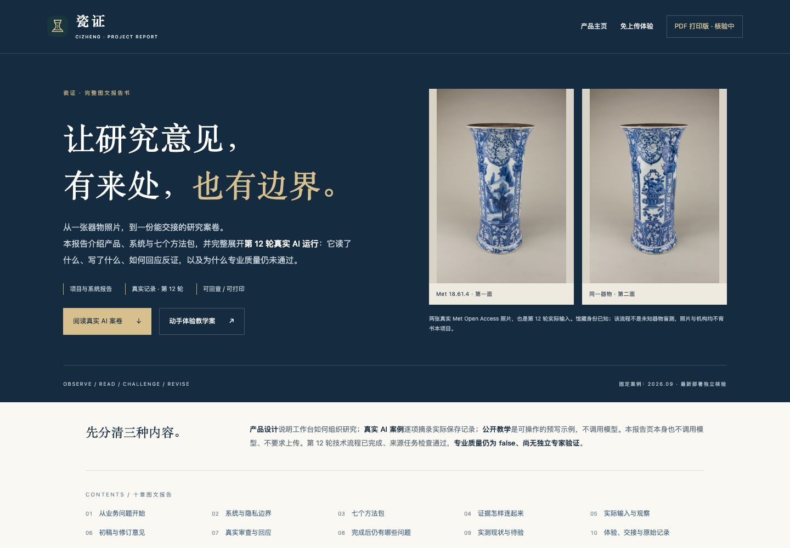
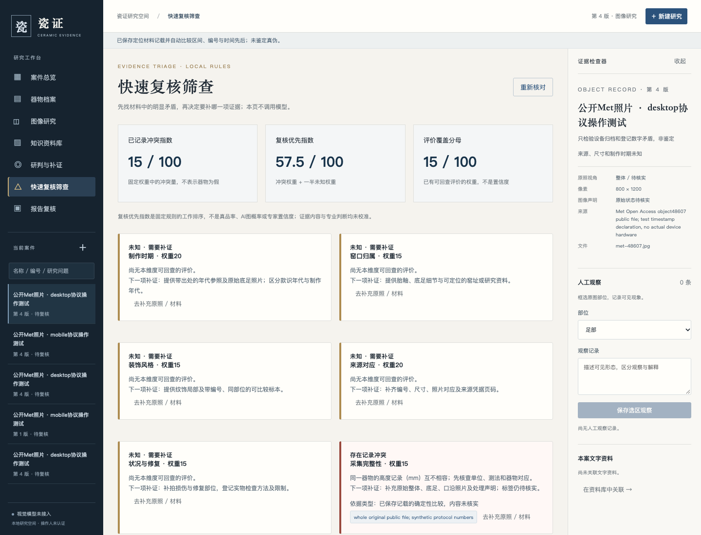
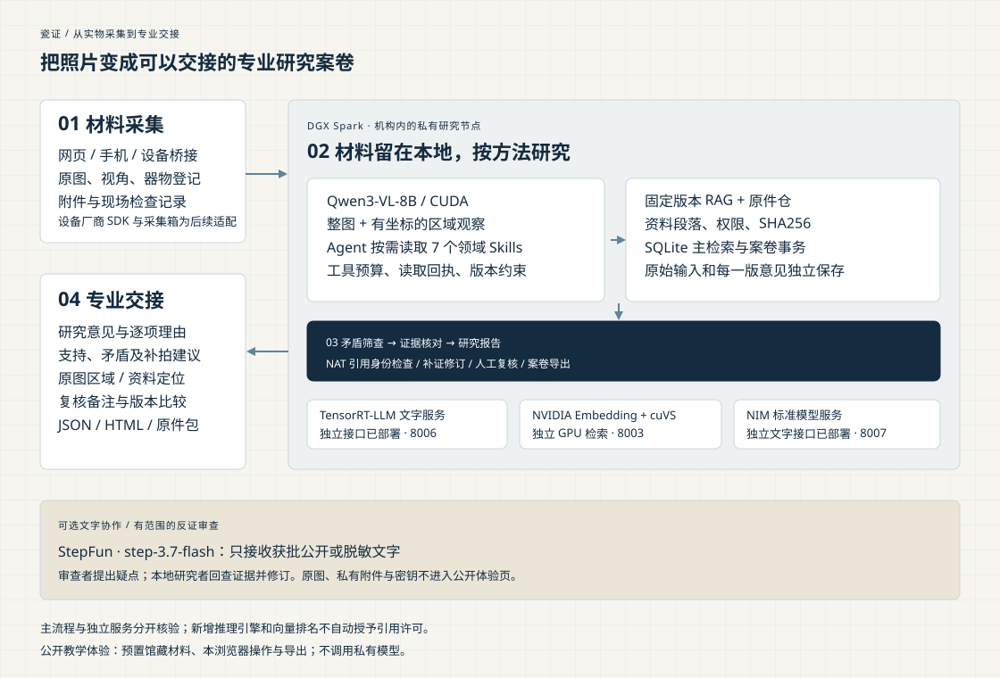
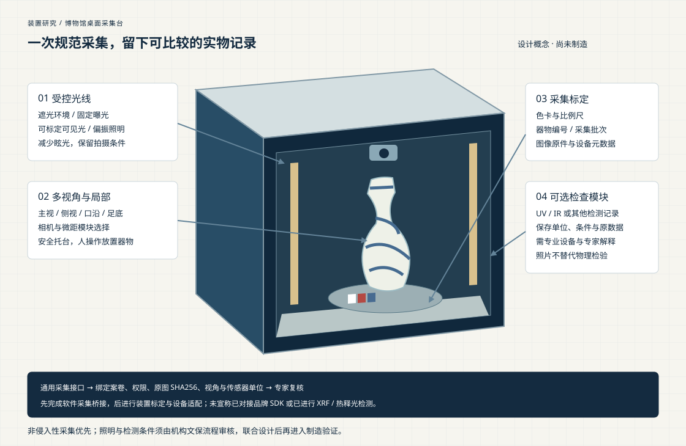

# 瓷证 CIZHENG

**陶瓷证据研究 Agent：从实物照片，到可以交接的专业案卷。**

面向博物馆编目、收藏档案与拍卖图录准备。瓷证把原图、区域观察、资料段落、研究方法和逐项理由放到同一份案卷里，找到矛盾，说明需要补充的材料，保留每一次判断如何改变。AI 负责观察与证据整理，专家负责专业复核。

[阅读完整图文报告书](https://dingyucanada.github.io/cizheng-agent-skills/report.html) · [下载完整 PDF](https://dingyucanada.github.io/cizheng-agent-skills/assets/cizheng-report-v08.pdf) · [免上传完整体验](https://dingyucanada.github.io/cizheng-agent-skills/demo.html) · [快速筛查体验](https://dingyucanada.github.io/cizheng-agent-skills/triage.html)

[](https://dingyucanada.github.io/cizheng-agent-skills/report.html)

[观看场景演示 · StepFun 中文旁白](https://dingyucanada.github.io/cizheng-agent-skills/assets/cizheng-demo-v07.mp4) · [已发表参赛征文](https://zhuanlan.zhihu.com/p/2088103686509744413) · [项目主页](https://dingyucanada.github.io/cizheng-agent-skills/)

## 项目文档入口

| 文档 | 本页内容 | 完整说明 |
|---|---|---|
| **项目说明文档** | [作品特点、技术实现、架构与优化](#项目说明文档) | [项目说明](docs/project-overview.md)：业务场景、研究步骤、创新机制、实现与验证 |
| **部署说明** | [免模型本机启动与 Spark 连接](#部署说明) | [部署指南](docs/deployment-guide.md)：五项实际服务、依赖、启动脚本、模型优化、Skills 与检查顺序 |
| **技术栈说明** | [实际组件及架构图](#技术栈说明与系统架构) | [技术栈清单](docs/technology-stack.md)：NVIDIA SDK / 版本 / 模型、StepFun 与各自接入范围 |

完整开源交付包含前后端、七个 `SKILL.md` 方法包、部署脚本、教学素材、测试、图文报告及视频。[中文路演 PPT](https://dingyucanada.github.io/cizheng-agent-skills/assets/cizheng-pitch-v07.pptx) · [路演 PDF](https://dingyucanada.github.io/cizheng-agent-skills/assets/cizheng-pitch-v07.pdf) · [使用说明](docs/user-guide.md)

## 一件器物，三种专业工作的交接

| 工作场景 | 需要完成的工作 | 完整教学案卷 |
|---|---|---|
| 博物馆编目与研究 | 分开图像观察和馆藏记载；定位文献；记录视角缺口；交付可修订依据 | [山水纹花觚](https://dingyucanada.github.io/cizheng-agent-skills/demo.html?case=met-48607) |
| 收藏档案与来源 | 整理来源事件、器物标识和对应原件；发现矛盾；逐次补证 | [青花镂空茶壶](https://dingyucanada.github.io/cizheng-agent-skills/demo.html?case=met-51185) |
| 拍卖图录准备 | 核对描述、归属理由和状况措辞；交付报告、原件及文件清单 | [五彩耕织图瓶](https://dingyucanada.github.io/cizheng-agent-skills/demo.html?case=met-50839) |

公开教学体验预置三套完整材料，无需注册或上传，支持真实编辑、证据定位、补证比较、复核备注与 JSON / HTML / ZIP 导出。修改留在本浏览器。馆藏照片来自 Met Open Access，研究示例由项目编写，公开网页不调用私有模型；实际 AI 案卷单独在报告中呈现。

## 项目说明文档

瓷证是一套面向陶瓷专业工作的证据研究 Agent。博物馆研究人员需要把照片、馆藏记录和文献放在一起；收藏者需要整理来源及历次观察；拍卖图录人员需要说明每个归属判断的依据与措辞边界。传统聊天结果难以回答“这句话看到了哪张原图、读了哪段资料、后来补证为何改变意见”。瓷证以案卷为单位，把这些工作连成可交接、可修订的研究过程。

项目的核心特点是同时管理实物照片、观察与研究理由。用户可登记器形、尺寸、款识、来源和状况，查看整体及局部原图；视觉模型在 Spark 处理本轮照片，给出带图像关联的观察。制作时期、窑口与风格分别形成候选，逐项列出支持、冲突、缺失和竞争解释。研究报告由结构化案卷生成，汇集照片、观察、引用、理由、下一项补证及复核记录，并能导出 JSON、Markdown、HTML 与带清单的 ZIP。

技术实现采用 Python / FastAPI 案卷后端、浏览器工作台、SQLite 固定资料版本和本地 OpenAI 兼容视觉接口。七个领域 Agent Skills 把编目、青花比较、状况、来源、文字凭据和补证修订变成具体工具步骤。宿主先提供技能描述，按任务加载正文和参考资源，记录整包哈希、工具权限及预算。Skill 文件承载研究方法，程序执行原图查看、正文读取和记录校验，模型负责观察及有限判断。

架构以 DGX Spark 本地视觉和资料处理为中心。主视觉服务使用 Qwen3-VL-8B BF16，NeMo Agent Toolkit 核对引用的资料版本、段落、哈希与成功读取回执；获批公开或脱敏文字可进入 StepFun 反证审查，再交回本地模型重新看图和修订。另有真实部署的 NIM 标准文字接口、TensorRT-LLM 文字服务及 NVIDIA Embedding＋cuVS 检索服务，它们在独立范围验收后再评估业务接入。

优化围绕可解释结果和任务完成展开：规则筛查先比较六维记载，及时给出复核优先指数；协调器预读有限的本案材料，减少反复检索；结构约束解码与短动作协议控制输出形式，宿主继续检查证据、权限和版本。每轮设置调用与时间预算，超时、截断和未知信息保留为明确状态。新增照片或修订资料会使旧依据失效，避免历史意见被误当成当前结果。以上机制已有工程和实际运行记录，整案性能收益与专业效果以独立任务评测继续验证。

项目提供三套免上传教学案卷和真实模型流程原件。教学内容、合成规则检查、模型输出与专家复核分别标明来源；数值用于说明材料覆盖和复核工作优先级。专业价值在于让从业者看到判断为何成立、哪里仍有矛盾、下一步应取什么材料，并把研究交给下一位复核者。专家样本评价、真品概率校准与机构联合训练是后续工作。[完整项目说明与实现位置](docs/project-overview.md)

## 快速筛查：数字与理由一起看



制作时期、窑口、风格、来源、状况和采集六个固定维度，分列相符、冲突与未知。结构化记载绑定本案原件、定位与哈希，自动比较年份区间、高度、同编号体系身份和来源事件先后；补正保留历史。每个提示给出下一项补证。

- **复核优先指数**用于安排工作，固定分母 100，同时显示矛盾指数与已评覆盖。
- **未知单列**，没有发现矛盾也不会自动推成“真品”。指数不是真品率或 AI 置信度。
- **不等待模型**，本地规则先给可解释结果，完整视觉研究作为后续任务。

[直接体验准备好的规则示例](https://dingyucanada.github.io/cizheng-agent-skills/triage.html) · [公式、接口与验证范围](docs/risk-triage.md)

## 技术栈说明与系统架构



DGX Spark 将多模态研究、模型服务、方法执行与案卷存储放在机构内计算节点。GB10 / CUDA 与共享内存支持视觉和独立文字、向量检索服务共存；模型、资料和运行身份可以固定。原图在指定本机保存和处理；外部 StepFun 只接收获批公开或脱敏文字。

| 组件 | 在瓷证中承担的工作 | 接入范围 |
|---|---|---|
| DGX Spark / GB10 / CUDA 13.0 / Qwen3-VL-8B | 实际多图观察、局部像素、逐项研究和补证修订 | 案卷主视觉流程；PyTorch 2.14.0+cu130 / Transformers 5.14.1 / BF16 |
| 七个领域 Agent Skills | 按任务读取方法、参考资源与检查要求 | 渐进加载、固定整包版本；宿主约束工具与预算 |
| NVIDIA NeMo Agent Toolkit 1.9.0 | 资料版本、段落、哈希与成功读取回执核查 | 主流程引用身份检查；独立离线环境 |
| StepFun / step-3.7-flash | 真实批准文字反证审查，提出断代、窑口及风格支持问题 | 可选文字协作；本地模型回查并修订 |
| StepFun / stepaudio-2.5-tts | 18个公开讲稿段落的中文演示旁白，按实际词时间戳对齐字幕 | Demo制作；官方儒雅男士音色、原速、固定画面，[回执与复现](verification/media/stepfun-demo-v10/index.json) |
| TensorRT-LLM 1.3.0rc13 | 固定官方 ARM64 / Qwen3-4B-Instruct-2507 文字推理与 CUDA 轨迹 | 已部署独立文字端点；PyTorch backend，未生成序列化 TRT engine |
| NVIDIA Embedding + cuVS 26.8.1 | `llama-nemotron-embed-1b-v2` / 2048 维 CUDA 索引，实际中文查询 | 已部署独立检索；主案卷保留 SQLite 固定正文路径；非完整 Retriever SDK 管线 |
| NVIDIA NIM · Spark 分发 2.1.8 | 官方 Spark ARM64 Model-Free NIM / Qwen3-4B BF16，原厂 SDK 服务入口 | 已部署独立标准文字接口；nim_sdk 0.12.7 / SGLang 0.5.16；实际请求与 CUDA 绑定 [回执](docs/nim-v09-update.md) |
| Nsight Systems 2025.3.2 / PyTorch Profiler | Nsight 采集限定双图视觉区间；独立 TensorRT-LLM 与 NIM 文字请求使用 PyTorch / SGLang Profiler 核对前八步 CUDA | 各自绑定原请求；不将单次采样称为整案提速 |

新推理与检索服务按独立范围验收，未经业务验证的候选不自动替换主流程。真实 AI 案卷保留双图观察、初稿、批准文字审查、本地修订、两版引用核查和六份导出，原始记录可回查；独立专家样本评价和同预算方法对照列入后续计划。

依赖环境相互隔离，CUDA 13.0 / 13.1 分别对应实际原生服务与 TensorRT-LLM 容器。[完整技术栈与固定身份](docs/technology-stack.md)列出模型、SDK、版本、作用及原始证据，避免把已部署的独立模块算作主流程效果。

## Skills：方法怎样变成下一步

例如青花比较研究，先把可见器形和装饰与资料记载分开，读取实际正文，分别记录支持、矛盾及竞争解释；新增同器照片后指出哪些观察改变、哪些归属仍需要材料。

| 方法包 | 可执行的研究步骤 |
|---|---|
| [任务与补拍路由](skills/ceramic-route/SKILL.md) | 确认任务、输入覆盖、缺失部位和下一项材料 |
| [陶瓷编目研究](skills/ceramic-research-record/SKILL.md) | 分开器物登记、图像观察、资料记载与研究主张 |
| [青花比较研究](skills/bluewhite-attribution-test/SKILL.md) | 比较相符线索、反例与竞争解释 |
| [状况竞争解释](skills/condition-hypothesis-test/SKILL.md) | 区分照片迹象、状况假说和实物检查 |
| [来源经历核查](skills/provenance-evidence-audit/SKILL.md) | 核对来源事件、同器对应和原始凭据 |
| [文字凭据核查](skills/documentary-evidence-audit/SKILL.md) | 读取本案许可文字，分列相符、冲突与缺失 |
| [补证与版本修订](skills/evidence-revise/SKILL.md) | 说明新证据改变了什么，保留原意见与历史 |

方法包以描述、正文、参考资源按需加载，整包 SHA256 固定实际采用版本，领域方法由本项目开发。[NVIDIA Skills 官方文档](https://docs.nvidia.com/skills)及[官方仓库](https://github.com/nvidia/skills)提供平台方法参考；自研领域包不冒称官方认证。引用绑定实际读取的资料版本和段落；检索排名不替代正文阅读与引用许可。

## 现场采集与持续改进

统一采集会话与有界 multipart 接口、可运行 Python 客户端已实现，照片、视角、设备元数据与传感器单位记录进入同一案卷。公开实物照片已用于实际 HTTP 往返检查，原字节 SHA 保持一致。当前是受控采集桥接；品牌设备 SDK 和实物仪器需后续适配、标定。



后续路线聚焦专家样本评价、跨时间可比较采集和机构协作：经许可的专家反馈经过审核，形成离线训练材料；探索 NVIDIA FLARE 联合训练与 NeMo RL 后训练，再以独立保留集验证和版本发布。当前未建立联合训练网络、自动在线强化学习或专业实验室检测。

Laya 保留 [离线文字影子适配入口](integrations/laya_router/README.md)，用于后续任务路由评估，默认禁用；Jev 属于浏览器操作 Agent，可研究获准公开目录采集。两者不用于制造文物真品概率。

[设备接口与客户端](docs/device-capture.md) · [专家验证接入](docs/expert-validation-intake.md) · [部署与原始凭证](docs/spark-deployment-update-v08.md)

## 部署说明

要求 Python 3.11+。以下命令建立环境、导入教学材料并启动服务。`requirements-tested.txt` 固定实际测试依赖，`requirements.txt` 保留兼容范围。

```bash
git clone https://github.com/dingyucanada/cizheng-agent-skills.git
cd cizheng-agent-skills
python3.11 -m venv .venv
source .venv/bin/activate
pip install -r requirements-tested.txt
python -m cizheng.demo --guided --data-dir ./data
python -m uvicorn cizheng.api:create_app --factory --host 127.0.0.1 --port 8780
```

浏览器打开 `http://127.0.0.1:8780`。教学材料可重复导入，不覆盖后续人工修改，不请求模型。真实 AI 研究需另行配置视觉服务，见 [Spark 部署与验收](docs/spark-validation.md)、[模型选择](docs/model-selection.md) 与 [NVIDIA 集成复现](docs/nvidia-integration.md)。

当前 Spark 已核验五项回环服务：**视觉 8005、案卷后端 8780、TensorRT-LLM 文字 8006、Embedding＋cuVS 检索 8003、NIM 文字 8007**。后端应用版本为 **0.7.0**。`deploy/local.env.example` 的视觉示例是 8001；接入当前节点时须同时覆盖 `CIZHENG_MODEL_URL=http://127.0.0.1:8005/v1` 和 `CIZHENG_SPARK_PORT=8005`。示例文件不会自动被应用读取，环境变量须在启动进程前导出。

[部署指南](docs/deployment-guide.md)分开说明本机无模型试用、Spark 主流程、独立候选服务、NAT / Skills 设计及模型优化。密钥通过私人进程环境提供；StepFun Plan 使用 `https://api.stepfun.com/step_plan/v1`。所有模型接口保持回环绑定，通过私人 SSH 转发访问，GitHub Pages 仅提供公开教学体验。

| 工作区 | 可以完成的工作 |
|---|---|
| 案件总览 | 选择业务任务，查看准备度与下一项工作 |
| 器物档案 | 记录尺寸、款识、来源、状况检查和对应附件 |
| 图像研究 | 原图、双图、缩放、局部框选与人工观察；档案最多 30 图，本轮选 1–8 图 |
| 知识资料库 | 中文关键词检索，查看出处与段落，固定本案资料版本 |
| 研判与补证 | 配置模型后执行有预算的工具流程，保存主张与修订历史 |
| 报告复核 | 逐图观察、支持与冲突、分项理由及待补证；固定引用核查与 JSON / Markdown / HTML / ZIP 导出 |

没有模型时，材料登记、图像操作、资料检索、准备复核和离线导出仍可用。文字凭据任务只核对本案许可 UTF-8 TXT 与固定资料段落，不作视觉归属；PDF 当前保留原文件和定位，不自动 OCR。

## 验证与复现

新版筛查与采集接口已实际部署到 Spark：54 项节点定向合同测试、真实公开原图 HTTP 上传 / 回取逐字节一致。本机完整工程回归1120项通过、2项隔离 NAT 可选跳过，浏览器37项通过；这些测试检查软件行为，不是器物准确率。当前五项服务健康、应用版本与 StepFun 文字配置见 [新版部署记录](verification/software/v09/README.md)。


```bash
pip install -r requirements-structured-tested.txt
PYTHONDONTWRITEBYTECODE=1 python -m pytest -q -p no:cacheprovider tests integrations/spark_transformers/tests integrations/nvidia_retriever/tests
python scripts/build-public-site.py
npm ci --ignore-scripts
npm run test:web
```

历史 Spark ARM64 r15 工程回归为 **913 passed / 8 skipped / 1 warning，309.15 秒**；专项为 403 passed / 6 skipped / 1 warning，143.49 秒。原生生产服务仍为 r11；包含 8 项新增阶段 Schema 的原生测试在 r14 实测 147 passed / 1 warning，4.54 秒，生产代码与 r15 相同。这些工程检查均为 0 次 GPU 模型请求；公开核心、集成与测试 Python 文件另与实际 r15 部署清单逐 SHA 核对 86/86，范围不包含整个 Git 仓库。见 [工程记录](verification/nvidia/v07-workflows/engineering-checks-v07.json) 和 [源码一致性](verification/nvidia/v07-workflows/runtime-public-python-parity.json)。

工程检查覆盖原件保留、跨案权限、资料版本、读取回执、预算、修订和导出。纯色图、脚本模型和模拟网络只用于软件合同，不衡量陶瓷鉴定能力。后续将纳入独立专家材料，并开展相应概率校准研究；接入字段与盲评流程见 [专家验证接入](docs/expert-validation-intake.md)。专业比较应固定模型、资料与预算，保留失败；少量个案不能推出行业准确率。

[评测协议](evals/PROTOCOL.md) · [评测口径](BENCHMARK.md) · [专家材料接入](docs/expert-intake.md) · [报告与数字口径](docs/authenticity-and-scoring.md) · [受控工作流](docs/controlled-workflow.md)

## 仓库导航

```text
cizheng/              案卷服务、工具、资料库、模型与评测适配
static/               本地专业工作台界面
site/                 产品主页与免上传教学体验
skills/               七个方法包及参考资源
knowledge/            原创来源摘要与出处
examples/public-demo/ 公开馆藏图像、许可和教学材料
integrations/         NAT 插件与 Spark GPU 适配器
deploy/               本地与 Spark 环境、启动及配置
docs/                 产品、使用、架构、部署与权利说明
verification/         已执行的运行证据及失败记录
evals/ tests/          专业评测协议与工程检查
```

## 适用范围与许可

当前提供单人受控试用，尚未实现机构多用户授权、可信专家签署、实物检测、价格评估或产权审批。**采集覆盖指数**仅反映本轮照片所标注的整体、底足、口沿、釉面和纹饰覆盖；真品概率保持“待校准”。研究报告用于继续研究与人工复核，不是自动鉴定证书。

项目自研代码采用 [MIT](LICENSE)。Met 图像和基本记录遵守馆方 Open Access / CC0；资料与依赖保留各自许可，原机构不背书本项目。见 [第三方来源与权利](THIRD_PARTY.md)。GitHub Pages 只发布 `site/`，不发布私人数据库、密钥、模型权重或用户培训材料。发布副本前可阅读 [公开部署说明](docs/github-pages.md)。
