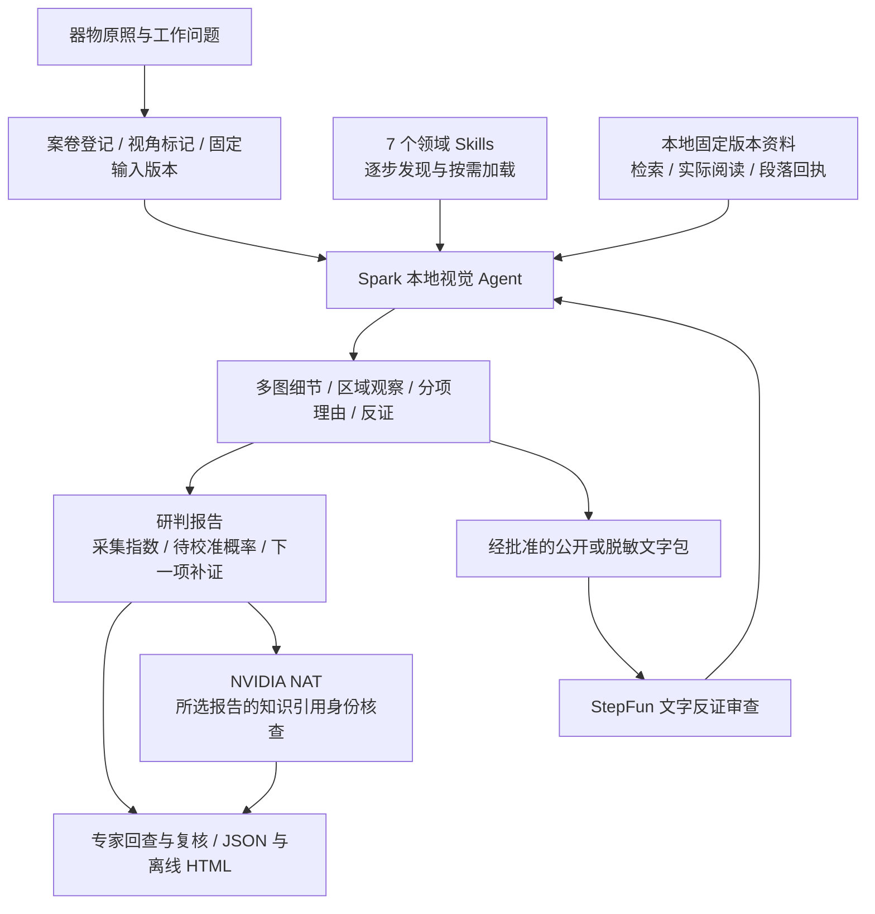

# 瓷证 · 评分要求与技术证据

更新说明（2026-09-29）：下方旧第05轮、待部署与框架计划保留为当时记录。当前第12轮技术流程完成但专业质量未通过；本次另完成TensorRT-LLM独立文字/CUDA与NVIDIA开放embedding+cuVS独立检索部署，NIM仍需官方授权。最新证据见[当前状态](../STATUS.md)和[本次部署](spark-deployment-update-v08.md)，不能把下方旧“最新”误读为当前结果。此对照只供工程与提交核查，不显示在产品主页。

最新完整第05轮已实际失败：4次模型、10次工具、服务端136.052秒。两张原图产生实际观察，协调器按本轮观察加载青花方法；下一主动作90秒超时，没有AI报告、该报告的NAT核查、StepFun反证或修订导出。固定文字格式合成探针也90秒超时，155.686秒晚到结构合格记录只按独占窗口关联。当前ARM开发源码129项流程CPU合同通过，不能替代以上业务失败。最新版本和证据见[当前状态](../STATUS.md)、[第05轮](../verification/nvidia/compact-workflow-05/README.md)。

本页依据参赛者提供的官方培训截图：实用性与创新25%、智能体与模型技术25%、完整性20%、平台适配15%、演示10%、征文5%。它是作品与证据的对照，不是预测评委得分。正式提交还需核对组委会表单与截止时刻。

## 本期架构与验收边界

下图表示应用已经实现的编排接口和完整任务路径，各环节的验收证据见下表。2B已有真实GPU图像生成与自由文字描述，但公开两照片的复杂Agent流程仍失败；8B已通过真实GPU热身及原始三项探针，旧c005公开实图run02仍失败。开发版本c006的run03已产生具体观察，但报告字段连续不合规，尚无完整Agent成功结论。结构约束在真实GPU上通过格式验证后，full-workflow01因12次调用预算耗尽仍未形成报告。受控准备后的full-workflow02成功读资料和看图，但第一条主动作超过90秒等待，仍没有报告。短动作full-workflow03各次请求在等待时限内返回，但文献/参照编号语义错误仍使报告失败。StepFun已通过单独的公开文字探针，尚未完成主Agent接收反证并重新观察图片的闭环。

可选的[受控材料准备](controlled-workflow.md)由程序调用原工具，加载有限方法、读取本案固定版本最多两段资料并查看首批真实照片；与模型选择分别记录，预算不增加。这是一项编排变更，不能拿跨策略的运行声称自然Skills触发或因果增益。

NAT 的核查结果可附在报告中，但不会改写视觉意见，也不能把引用哈希一致解释为结论正确。模型需要重新观察新一轮原照后才能响应文字反证。文书核查另有本地任务，未读取的 PDF 正文不会被声称读过。

## 按权重落实成果

| 官方评分项 | 本作品的可检查实现 | 证据与复现入口 | 尚需补强的真实证据 |
|---|---|---|---|
| 实用性、落地与创新 25% | 博物馆编目、收藏来源整理、拍品研究三种流程；多图细节与分项理由的受控报告结构；补证形成新版本；独立离线案卷交接 | `static/` 专业工作台；公开三案完整体验；[报告口径](authenticity-and-scoring.md) | 真实从业者与专家验收；不能拿已知馆藏教学案声称独立鉴定 |
| 智能体与模型技术 25% | Skills逐步加载、受控原图与局部查看接口、竞争解释、固定引用、单轮与案卷预算；本地视觉与文字审查职责分开；有界视觉协议与保留可信方法正文的上下文压缩；NAT注册组件及评测 | `cizheng/agent.py`、`skills/`、`integrations/nvidia_nat/`、`evals/PROTOCOL.md` | 完整实图Agent验收；同一视觉模型、同一独立样本集的有/无Skills对照；专家解释质量评估 |
| 项目完整性 20% | 实际前后端、预置三案、操作草稿保护、原图与资料导出、私有部署、回归工具 | README启动入口、工程CI、当前开发源码615项Python软件合同通过（2项可选NAT检查在独立环境通过）与33项公开体验测试通过，静态站点校验通过 | 机构多用户权限、可信专家签署、生产运维仍未实现，不宣传为机构生产认证系统 |
| 平台适配 15% | Spark GB10真实CUDA与BF16运行；2B与8B生成热身、CUDA事件与进程allocator峰值；NVIDIA NAT正式插件在本机和Spark的运行；SkillSpector实际扫描；StepFun公开文字探针 | [NVIDIA集成](nvidia-integration.md)、[Spark验收](spark-validation.md)、[公开运行记录](../verification/nvidia/README.md) | 2B与8B旧c005复杂Agent均未完成，8B run03因字段合同失败，结构约束后的full-workflow01又因调用预算耗尽；冷/热负载与优化对照未完成。CUDA运行不等于领域质量或平台加速已证实 |
| 演示效果 10% | 无需上传即可走完三类教学案，实际编辑、定位、补证、复核及导出；专业后端可导入同案 | GitHub Pages `demo.html`；本地工作台；[演示脚本](demo-and-submission.md) | 实际操作录制视频、B站作品URL；公开教学页面不执行模型 |
| 赛事征文 5% | 记录原方案错误、技术取舍、部署失败与修复、方法适用边界 | [开发文章草稿](development-article-draft.md) | 公开发布文章URL未完成 |

表中的测试数量只描述对应工程合同；不等于陶瓷鉴定准确率。NAT与SkillSpector提供接口及技能治理证据，智能体与模型项仍需完整任务和独立效果评估；采用SDK的数量不构成获奖或得分承诺。节点与模型的最新事实以 `STATUS.md` 和对应实测记录为准。

## NVIDIA 技术的选择原则

NVIDIA Skills 文档提供技能发现、扫描、评测及发布治理；`nvidia/skills` 是产品技能目录。编写兼容的 `SKILL.md` 不等于通过 NVIDIA Verified，也不意味着必须把应用全部迁移到某个专属运行时。[NVIDIA Skills 官方说明](https://docs.nvidia.com/skills)、[官方目录](https://github.com/nvidia/skills)

本期选择 NeMo Agent Toolkit 的正式插件、工作流与评测接口，承接可独立复现的引用身份核查。已有视觉 Agent 保留其图片、权限、预算和固定版本约束。NAT为跨框架的工作流、观察及评测提供接入点；是否带来性能或质量提升，仍要实际比较。[NeMo Agent Toolkit](https://github.com/NVIDIA/NeMo-Agent-Toolkit)

SkillSpector 扫描用于查找技能包的问题，工程测试与实时有/无 Skills 评测各自承担不同验证。扫描没有发现问题，不能证明方法有效或领域判断正确；正式验证还有任务集和真实 agent 的对照运行。[官方评测流程](https://docs.nvidia.com/skills/evaluating-agent-skills)

TensorRT-LLM、NIM、Dynamo、NeMo Retriever、RAG Blueprint 可作为后续候选。本期没有把它们全部列为已集成：单节点低并发应用应先找到真实瓶颈，再选择推理引擎、索引、重排或服务编排。需要模型下载、许可、ARM64兼容及性能验证的技术，在完成验证前保持候选状态。没有完成的 SDK 不计入已使用技术栈。

后续候选的接入顺序由以下条件决定；这是本项目的取舍，不是官方对评分的承诺：

| 候选 | 解决什么问题 | 接入前的实际门槛 |
|---|---|---|
| 主视觉流程的NAT观测 | CPU引用核查已有真实profiler；后续把实际视觉HTTP调用放入同一观测 | 先完成真实报告链路，再映射实际HTTP模型的tokens与阶段；现有NAT评测运行指标不等于主视觉Agent已被profiler完整观测 |
| NeMo Retriever / RAG Blueprint | 专家批准文献扩充后，提取、多模态检索和重排 | 先有带许可的文献与专家检索问题集，再比较召回、错引和耗时；25条短摘要不能证明需要GPU索引 |
| TensorRT-LLM / NIM | 已测到生成延迟成为完整任务瓶颈时，比较推理服务 | 固定模型、精度、图像与预算，实际核对GB10/ARM64和模型支持，再测延迟、内存及关键细节保留；不能从安装成功推定加速 |
| Dynamo | 机构多人并发、服务扩展与调度 | 先定义实际并发目标与负载；本期单节点单并发不宣称分布式调度收益 |

官方功能入口：[RAG Blueprint](https://github.com/NVIDIA-AI-Blueprints/rag)、[TensorRT-LLM](https://github.com/NVIDIA/TensorRT-LLM)、[Dynamo](https://github.com/ai-dynamo/dynamo)。这些框架尚未在本项目部署或计入已用技术。

| 已采用的技术 | 在瓷证承担的工作 | 实际验收边界 |
|---|---|---|
| DGX Spark / GB10 / CUDA 13 / BF16 | 原图在节点内进行视觉模型生成；PyTorch 2.14.0+cu130运行；项目目录内修复ARM64运行依赖 | GB10真实矩阵检查、2B与8B加载和生成热身；8B三项原始协议探针通过。保留首次缺少Python头文件及完整Agent失败，不据此声称鉴定准确率 |
| CUDA事件与PyTorch allocator | 记录2B与8B合成单图生成的当前流事件间隔及本进程显存分配峰值 | 有真实响应与日志对照；模型和输出长度不同，不能计算速度增益。峰值包含模型和缓存，不是全节点统一内存占用，也不是纯kernel时间 |
| NeMo Agent Toolkit | 注册受控证据组件，运行工作流，审计报告原版本的引用身份 | 本机真实CLI及三案软件合同评测；Spark真实CLI与隔离应用ASGI HTTP合同。0次模型调用，不为真伪或主张正确性评分 |
| NVIDIA NAT profiler 1.9.0 | 实际记录CPU检索与引用核查的嵌套时间轨迹，生成ATIF、CSV、Gantt和指标 | 三个软件样例，42事件、9 SPAN与9 FUNCTION，0模型与联网；不是主Qwen流程、GPU性能或领域效果 |
| NVIDIA SkillSpector | 扫描进入Agent的技能范围，保留完整包诊断与排除项 | 7个运行技能静态扫描完成；完整包诊断仍保留评估脚本发现，不称NVIDIA Verified |
| NVIDIA官方Agent Skills方法 | 开发阶段使用正式产品方法，领域运行采用渐进加载与固定方法身份 | 开发阶段实际研读并应用4个NAT官方技能；不是用户视觉Agent执行了4个NVIDIA技能。瓷证领域技能仍需独立专家任务的有/无技能对照 |

PyTorch使用的Triton编译器已经在节点生成CUDA kernel缓存。这不是NVIDIA Triton Inference Server；本期没有部署该推理服务器。选择后续框架时，以补齐当前功能或测出收益为准：先完成多照片报告和反证修订，再用同模型、同图片、同预算验证推理优化或检索质量，避免安装新框架挤占完整性与演示验收。

8B旧c005实图验收的两个结构合格观察均只有模板句“直接可见现象”，有效语义观察为0；区域图GPU生成约139.255秒，超过90秒客户端等待，并非token截断。c006开发版将视觉输出限制为800 tokens和48 / 24 / 32字符短字段，动作仍为2500 tokens，保留可信方法正文及模型12次、工具20次、总300秒、单次等待90秒预算。第03轮视觉224 completion tokens、20.947秒，产生两条具体描述（内容尚未由专家评定）；随后主动作遗漏必填字段、使用非法判断维度，连续校验失败。结构约束已在真实GB10 GPU上执行：固定LM Format Enforcer 0.11.3通过token前缀限制生成合成红图JSON，7 completion tokens、2.348秒；这只验证格式与传输。随后公开两图full-workflow01仍失败：12次实际模型、16次工具、207.586秒，全部响应stop，9次动作结构校验通过，但模型反复读取资料和查看图片耗尽预算，没有报告、NAT核查或StepFun审查。五条入库观察未测专业准确性。旧失败保留，完整业务尚待验证。

## 当前最容易被评委质疑的地方

第一，照片与来源材料不能单独建立真实年代，尤其面对高仿和修复。第二，25条来源短摘要没有覆盖古陶瓷全部窑口和断代知识，模型必须保持领域与证据边界。第三，硬件上跑通、引用身份核查通过与真正的专家效果是三份不同证据。参赛演示应主动用一个缺证或冲突案例展示保留判断与补证流程，而不是只播放成功案例。

第04轮保留失败：源清单270文件，Spark两图任务6次模型、10次工具、141.783秒，六次响应全部stop且直接匹配节点原始SHA和usage。3条实际观察未由专家审定；模型先用标点写竞争解释，修正时正确引用本轮已读文献，但遗漏必须加载的方法，原证据合同拒绝发布，没有报告、NAT或StepFun。证据见 [逐调用记录](../verification/nvidia/compact-workflow-04/phase-trace.json)。
