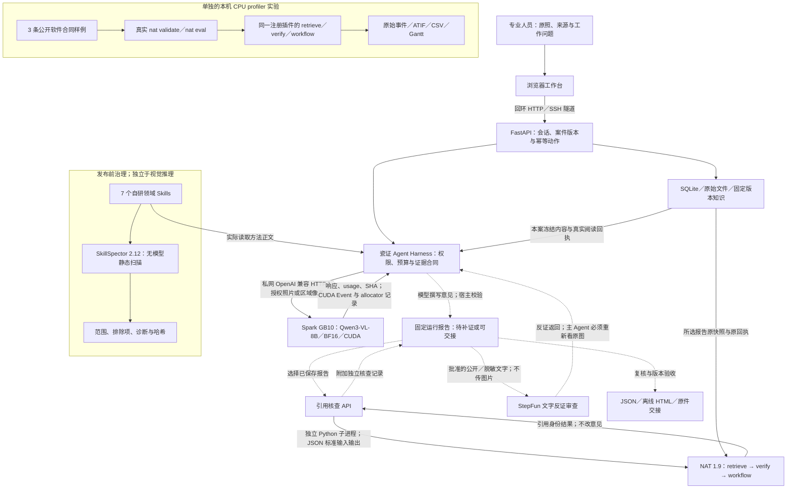

# 瓷证 · NVIDIA 架构与可验证的采用路线

本项目把 NVIDIA 技术用于三件具体工作：在 Spark 内处理器物原图，核对报告所用资料的固定身份，检查进入 Agent 的方法包并保留运行轨迹。新增技术必须补齐一个实际功能或测出一个收益；SDK 数量不用于预测得分或获奖。

截至本页编写时（2026-09-28），真实完整 `workflow05` **已实际验收失败**：4次模型、10次工具，双图观察及方法加载完成，主动作90秒超时，没有AI报告或后续反证闭环。GPU 图像生成、NAT 引用合同、CPU profiler 与静态扫描各有实测，但不能拼接成“视觉研判 → 引用核查 → 文字反证 → 重新看图 → 修订导出”已经成功的证据。历次完整任务的失败保留在 [运行证据索引](../verification/nvidia/README.md)；本页是实现与实验设计说明，不是独立盲评结论。

## 1. Skills、框架与认证的三层含义

**Agent Skills 是开放的方法包格式。** 一个目录以 `SKILL.md` 表达元数据和方法，按需附带资源或脚本；渐进加载将描述、正文和资源分开。这不是 NVIDIA 专属运行时，也不自动赋予文件、网络或工具权限，实际能力由宿主执行和约束。[开放格式规范](https://agentskills.io/specification)

**NVIDIA Skills 是使用 NVIDIA 产品的官方方法目录。** `nvidia/skills` 汇集产品仓库维护的技能，支持兼容的 Agent 客户端；读取一个部署方法不等于部署了对应框架，更不等于模型在业务中使用了它。[NVIDIA Skills 文档](https://docs.nvidia.com/skills/)、[官方目录](https://github.com/nvidia/skills)

**NVIDIA Verified 是发布治理状态。** 官方要求来源与目录归属、扫描、任务效果评估、签名和 Skill Card。瓷证的七个陶瓷领域包是项目自研；已扫描的范围不等于通过全部发布门槛，当前保持 `nvidia_verified_skill=false`。[官方信任要求](https://docs.nvidia.com/skills/)、[发布清单](https://docs.nvidia.com/skills/release-checklist)

七个运行方法为 `ceramic-route`、`ceramic-research-record`、`bluewhite-attribution-test`、`condition-hypothesis-test`、`provenance-evidence-audit`、`documentary-evidence-audit`、`evidence-revise`。宿主固定方法包身份，按描述发现、实际读取正文和按需读取资源；方法是否改善陶瓷研究仍需独立样本的有／无 Skills 对照。[方法目录](../skills/)、[评测协议](../evals/PROTOCOL.md)

开发阶段另外实际研读并应用四个官方 NAT 技能，固定到 Toolkit commit `c7e1162a1c7ff18bbd797e090a56cad97c281c92`，再以已安装 1.9.0 API／CLI 验证实现：

| 官方开发技能 | 本项目落实的工作 | 可检查实现 |
|---|---|---|
| [nat-user-rules](https://github.com/NVIDIA/NeMo-Agent-Toolkit/blob/c7e1162a1c7ff18bbd797e090a56cad97c281c92/skills/nat-user-rules/SKILL.md) | 发现已注册组件，使用真实类型 | CLI 组件发现记录 |
| [nat-workflow-creation](https://github.com/NVIDIA/NeMo-Agent-Toolkit/blob/c7e1162a1c7ff18bbd797e090a56cad97c281c92/skills/nat-workflow-creation/SKILL.md) | 配置校验后做最小运行 | `nat validate` 与 `nat run` |
| [nat-tools-and-functions](https://github.com/NVIDIA/NeMo-Agent-Toolkit/blob/c7e1162a1c7ff18bbd797e090a56cad97c281c92/skills/nat-tools-and-functions/SKILL.md) | 正式注册受控引用组件 | `FunctionInfo.from_fn()`、`nat.components` 包入口 |
| [nat-evaluation](https://github.com/NVIDIA/NeMo-Agent-Toolkit/blob/c7e1162a1c7ff18bbd797e090a56cad97c281c92/skills/nat-evaluation/SKILL.md) | 用明确的软件样例验证合同并保存结果 | 正常引用、篡改引用、无读取回执三案 `nat eval` |

这些是开发者使用官方方法的证据，不是 Qwen 视觉 Agent 执行了四个 NVIDIA 技能。官方 SkillEvaluator 的 Tier 3 在指定 Agent 宿主运行两臂任务；瓷证自定义工具仍需真实宿主映射，不能直接拿另一宿主的成绩代替本项目视觉对照。[Tier 3 说明](https://docs.nvidia.com/skills/skillevaluator/tier3-live-evaluation)

## 2. 已实现接口的传输与职责

下图表示接口和职责；虚线是尚未通过完整验收的业务路径。实线也只表示对应组件已有局部运行或软件合同证据，完整业务结果须另看验收记录。



Harness 保留每轮 12 次模型、20 次工具、300 秒及案卷累计预算，失败和取消计入用量。模型负责观察、解释、竞争假设和意见；程序核对版本、权限、实际图片送达与引用身份，不填写真伪结论。文字任务保持独立工具和输出合同，不能由资料正文获得额外执行权限。[产品架构](product-and-architecture.md)

NAT 的入口是 `POST /api/cases/{case_id}/nvidia-audits`。正式插件 `cizheng-nvidia-nat==0.1.0` 注册检索、核验、组合工作流和引用合同评估器。检索只见本案已关联版本；保存报告核查使用原 `knowledge_snapshot`、原运行阅读回执及报告引用，后来重绑定资料不替换旧依据。核验文档 ID／版本／SHA、段落 ID／SHA／locator 六项身份；不判断文本是否支持年代、归属、产权或真伪。结果持续标明 `review_required=true`、`inference_performed=false`、`claim_support_assessed=false`。[注册实现](../integrations/nvidia_nat/src/cizheng_nat/register.py)、[接口与安装](nvidia-integration.md)

## 3. 已使用 NVIDIA 技术的实测范围

| 实际组件 | 解决的具体问题 | 证据及边界 |
|---|---|---|
| DGX Spark／GB10／CUDA 13.0／BF16 | 授权原图在本地视觉服务生成，避免将图片送入文字反证服务 | ARM64、PyTorch `2.14.0+cu130`；真实 FP32／BF16 矩阵、8B 权重 SHA、加载热身与三项原始图片／JSON 探针。[矩阵](../verification/nvidia/spark-gpu-math.json)、[权重](../verification/nvidia/spark-qwen8b-official-weights.json)、[探针](../verification/nvidia/spark-qwen8b-probe.json)。不是独立陶瓷效果评测 |
| CUDA Event 与 PyTorch allocator | 给真实生成请求记录 GPU 时间区间和本进程分配峰值 | [2B](../verification/nvidia/spark-cuda-observer.json)与[8B](../verification/nvidia/spark-qwen8b-cuda-observer.json)合成单图记录分别约 318.234／542.147 ms；模型与输出长度不同，不能据此比较加速收益 |
| NeMo Agent Toolkit 1.9.0 | 可复现地核对所选报告的固定引用身份 | 本机真实 CLI／三案评估及软件 API fixture；Spark 独立环境真实 CLI／ASGI 合同，0 模型调用。[本机 CLI](../verification/nvidia/nat-cli-eval.json)、[报告 API](../verification/nvidia/nat-backend-api.json)、[文书 API](../verification/nvidia/nat-documentary-api.json)、[Spark 合同](../verification/nvidia/nat-spark-api-contract.json)。没有据此证明完整视觉报告已审计 |
| NAT profiler 1.9.0／官方 `track_function` | 查明注册引用工具的实际调用层级和 CPU 跨度 | 一次真实离线 `nat eval`：42 原始事件、9 个显式 SPAN、9 个独立原生 FUNCTION、0 LLM 事件／调用。[完整轨迹与状态](../verification/nvidia/nat-profiler-01/README.md)。不含 Qwen 生成或 GPU profiler |
| NVIDIA SkillSpector 2.12.0 | 检查交给 Agent 的方法包静态风险 | 7 个运行范围真实 `--no-llm` 扫描完成，范围内覆盖率 100%、0 发现；逐项记录排除内容。[运行范围](../verification/nvidia/skillspector-runtime.json)、[完整包诊断](../verification/nvidia/skillspector-full-bundle-diagnostic.json)。完整包评估脚本发现仍保留；不是专业有效性或 Verified 认证 |

CUDA Event 测的是当前流的生成区间，CPU 图片预处理不在其中，主机发射空隙可能在其中；不是所有 kernel 时长的和。Allocator 包含本进程模型和缓存，不是 GB10 全部统一内存或其它进程占用。[观测口径](nvidia-integration.md)、[Spark 硬件说明](https://docs.nvidia.com/dgx/dgx-spark/hardware.html)

CPU profiler 的 42 事件由 FUNCTION／SPAN 各 9 对 START／END，加 3 对 WORKFLOW START／END 构成；三个样例各调用 retrieve、verify、workflow。原生图将两层均标为 FUNCTION，18 行不是 18 次业务动作，嵌套时长不能相加。CLI eval 墙钟 16.371 秒包含初始化、评估、分析和绘图；内部 workflow SPAN 约 47.425／3.370／2.879 ms，仅指本机 CPU 软件合同。ATIF 12 steps 记录输入、工具和无模型结果，联网审计为 0 次尝试。[公开原始轨迹](../verification/nvidia/nat-profiler-01/nat-eval/all_requests_profiler_traces.json)、[公开字节与脱敏范围](../verification/nvidia/nat-profiler-01/redaction-manifest.json)

复现 profiler 时使用隔离 NAT 环境，输出到一个不存在的新目录；入口实际调用 `nat validate` 和启用 profiler 的 `nat eval`，不是自行绘制模拟跨度：

```bash
PYTHONDONTWRITEBYTECODE=1 .venv-nvidia/bin/python scripts/nvidia-nat-profile.py --output .tmp/nat-profiler-new
```

入口在导入 Toolkit 前清除继承的模型凭据与远程导出配置、阻断外连；不改旧运行结果。[复现脚本](../scripts/nvidia-nat-profile.py)、[官方 profiler 使用方式](https://docs.nvidia.com/nemo/agent-toolkit/latest/improve-workflows/profiler.html)

节点已生成的 [Triton 编译器缓存](../verification/nvidia/spark-triton-compiler-cache.json)来自 PyTorch 运算，**不是 NVIDIA Triton Inference Server**。当前模型由 Transformers 原生适配器服务；LM Format Enforcer 0.11.3 是第三方格式约束组件。[原生适配器](../integrations/spark_transformers/README.md)

## 4. 按 25／25／20／15／10／5 权重补齐证据

权重来自参赛者提供的官方培训截图。下表列的是实际验收动作，不是预估评分；正式提交材料仍以组委会要求为准。[评分证据对照](competition-score-evidence.md)

| 评分项 | 本作品应交付的可检查结果 | 下一项证据动作 |
|---|---|---|
| 实用性与创新 25% | 一份专业人员能回到原图、资料段落与未知项的证据案卷 | 请实际从业者用一个工作问题完成登记、回查和下一项补证；记录是否可用及修改意见。已知馆藏教学案不充当独立鉴定样本 |
| 智能体与模型技术 25% | 模型实际看图、加载适用方法、引用已读内容、提出竞争解释、响应反证 | 先解决已暴露的延迟并完成完整业务；再冻结同模型、同图片、同预算，以独立专家任务做有／无 Skills 两臂对照，保留触发失误、失败成本和无收益结果 |
| 完整性 20% | 案卷版本、权限、取消、报告核查与离线交接可复现 | 对所选发布源码完成启动与真实案卷交接验收，绑定源码及输出 SHA。现有 [工程证据](../verification/nvidia/current-engineering-01/README.md)为 Python 615 passed／2 optional skips、DOM 33 passed、独立真实 NAT 环境 22 passed／0 skips；范围重叠，不能相加，也不等于领域准确率 |
| 平台适配 15% | Spark 的真实 CUDA 请求，以及 NAT／profiler／SkillSpector 各自承担的工作 | 在完整报告产生后实际核查该报告，关联客户端响应与节点日志；若优化推理，再按固定任务比较冷／热延迟、内存和合同失败率。CPU 引用轨迹不冒充视觉模型轨迹 |
| 演示 10% | 真实操作视频同时展示可交接案卷和一个缺证／冲突处理过程 | 录制实际验收结果，注明教学页不执行模型；提交作品视频 URL 与要求的团队材料。不能用静态页面或剪辑替代未完成的业务步骤 |
| 征文 5% | 超过 500 字、可查来源的技术取舍和实际运行结果 | 从 [文章草稿](development-article-draft.md)完成可公开版本，附复现入口与局限，再提供实际发布 URL |

工程记录对应 development compact03 的 296 文件清单，SHA 为 `945a8f4069d572f7b2ebcf8cbcdb471a7e01e14ac0d67752cc5310f28d825cd5`；它不是本页后续编辑后的发布清单，历史 c005 节点 342 项也不能替代当前版本。[工程版本绑定](../verification/nvidia/current-engineering-01/README.md)

## 5. 尚未部署的框架：采用条件与首个可证伪实验

以下六项均为候选，**尚未在瓷证部署或计入已使用技术**。表中实验是本项目拟定方案，功能定位来自各自官方文档。先解决完整业务验收，再按实际瓶颈选一项；NIM 服务封装、TensorRT-LLM 推理引擎、Triton 服务调度和 Dynamo 分布式编排不是必须同时叠加的清单。

| 候选及具体问题 | 采用前提 | 第一个可证伪实验；不通过时的处理 |
|---|---|---|
| [NVIDIA NIM](https://docs.nvidia.com/nim/large-language-models/latest/introduction.html)：可维护的推理服务封装、健康与模型 profile 管理 | 明确容器版本、许可、GB10／ARM64、实际视觉模型与受控动作能力；逐项核对 [支持矩阵](https://docs.nvidia.com/nim/large-language-models/latest/reference/support-matrix.html)。有 Spark profile 不代表本项目组合已兼容 | 在隔离服务用固定权重与精度重放单图、双图顺序和动作 Schema 请求，保存输入／输出、usage、冷启动与峰值。任一关键路径不支持就停止迁移；更换模型必须另做质量实验，不能称作同模型加速 |
| [TensorRT-LLM 支持矩阵](https://nvidia.github.io/TensorRT-LLM/models/supported-models.html)：已测到的视觉生成延迟或内存瓶颈 | 当前矩阵列出 `Qwen3VLForConditionalGeneration` 的多模态能力，但具体 8B 权重、GB10 构建、精度与动作约束组合仍须实测；不能拿语言请求支持推定图片路径 | 固定图片字节、提示、输出上限与预算，对现有 BF16 服务及候选引擎测重复冷／热请求的端到端延迟、GPU 区间、峰值和合同通过率。预先写明收益门槛；图片顺序／细节或合同回退即不采用，不从一次请求宣称加速 |
| [NeMo Retriever](https://docs.nvidia.com/nemo/retriever/latest/extraction/overview/)：批准文献的版面提取、索引与重排 | 先取得许可文献、专家标注的相关段落和页码；保留不可变原件、段落定位及本案权限。现有 25 条短摘要不能证明 GPU 检索必要 | 用小型固定文献集，比对人工页码真值和现有关键词基线，记录提取错误、Recall@k、错引与耗时；尝试读取未授权文献必须失败。定位丢失、越权或检索无收益则保留原方案 |
| [NVIDIA RAG Blueprint](https://github.com/NVIDIA-AI-Blueprints/rag)：扩充后的检索—生成流水线参考实现 | 只有提取、检索、重排需要整体编排时才试；审查 NIM／数据库依赖、资源需求及部署路径，保留瓷证自己的固定阅读回执与意见权限 | 对同一授权集合做一条端到端文献问答，核对引用能否回到原页／原段，并用篡改哈希、案卷重绑定、未读取引用反例验证宿主合同。引用合同一旦被绕过，不能替换现有证据链；RAG 分数不当作陶瓷真伪成绩 |
| [NVIDIA Dynamo](https://docs.nvidia.com/dynamo/dev/knowledge-base/concepts/architecture)：多 worker 的 KV 感知路由或 prefill／decode 调度 | 先有实际机构并发目标、多 worker 资源和兼容后端；本期单节点串行生成没有已证明的分布式收益 | 在所需硬件已获授权后，用固定公共／脱敏请求做并发 1／2／4 的路由基线对照，记录端到端 p95、吞吐、排队、OOM 与每请求版本归属。无稳定收益、跨请求状态污染或维护成本超过需求就不采用 |
| [Triton Inference Server](https://docs.nvidia.com/deeplearning/triton-inference-server/user-guide/docs/user_guide/architecture.html)：多模型版本服务与按模型调度／批处理 | 有明确第二模型服务或批处理需求，并确认 ARM64、后端、模型输入输出和取消语义；不要与现有 Triton 编译器混淆。[模型仓库](https://docs.nvidia.com/deeplearning/triton-inference-server/user-guide/docs/user_guide/model_repository.html) | 先服务一个固定、无状态的提取／重排模型，重放两种长度的真实输入，比较串行与可用批处理的延迟、吞吐、版本 pinning 和排队超时。旧版身份漂移、延迟违约或无收益即不迁移视觉主链路 |

性能实验至少绑定源码、容器／依赖、模型文件 SHA、精度、图片 SHA、Schema、提示、随机种子、输出上限、超时和失败记录。先写采用阈值，再运行；测不到收益也保留结果。整机资源变化、不同模型或不同输出长度应分开报告，不能折算成框架收益。

在本次90秒等待失败后，推理优化应先区分模型计算、Schema／token前缀约束的CPU工作与主机提交间隙。下一项诊断候选是 [Nsight Systems／NVTX](https://docs.nvidia.com/nsight-systems/UserGuide/index.html)：在单独批准的测量运行中限定观察范围，核对CPU与CUDA时间线，再决定是否迁移推理引擎。此工具尚未部署或运行，不计入已集成技术；现有CUDA Event间隔不能单独定位根因。

## 6. 仍需领域证据的部分

独立专家器物样本、比较对象和真值标签尚未提供；三件已知馆藏是教学与功能材料。当前 `authenticity_probability.value=null`、状态为 `not_calibrated`，照片采集指数只表达材料准备情况。即使完整 `workflow05` 通过，也只建立该输入和合同范围的业务证据，不能据此给真实器物“真品概率”、专家认证或获奖结论。[概率与报告口径](authenticity-and-scoring.md)

下一步验收应交付固定输入的真实完整运行、所选报告的 NAT 核查、实际反证后的重新观察及修订导出；随后再由独立领域人员提供样本并评价解释与补证是否有用。技术扩充以这个任务的证据缺口为顺序。
