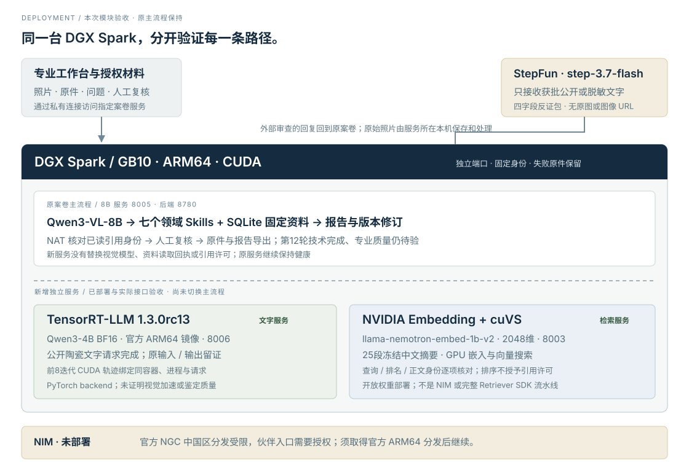

# 2026-09-29 · Spark 实际模块部署

原 Qwen3-VL-8B / 8005 与案卷后端 / 8780 保持运行。本次在同一台 GB10 增加独立 TensorRT-LLM 文字服务 / 8006 和 NVIDIA 开放 embedding + cuVS 检索 / 8003，完成真实请求及身份验收。**NIM 仍未部署**，官方分发需要授权。

## 两项实际运行的新增服务

| 服务 | 固定组合与实际结果 | 验收边界 |
|---|---|---|
| TensorRT-LLM | 官方ARM64 `1.3.0rc13` / Qwen3-4B-Instruct-2507 BF16；14权重文件8,060,918,292B全SHA核对；1公开陶瓷POST、0重试、stop、257输入+93输出tokens | PyTorch backend，没有序列化TRT engine；未替代8B视觉、未完成原案卷流程或专家质量验证 |
| NVIDIA embedding + cuVS | 官方 `llama-nemotron-embed-1b-v2` 固定revision `113abe4acafa848e77ead9c0623205e511932348`；13模型文件2,480,835,358B全SHA；25段/2048维CUDA矩阵+cosine索引；原client9真实HTTP/5中文query | 非Embedding NIM；SDK未安装、完整SDK管线未使用；原主流程仍SQLite，不给候选排名颁发引用许可 |

TRT对应CUDA轨迹实际核验3653有时长kernel事件、42不同kernel名和1264runtime事件；绑定同一容器、镜像、启动、进程、原输入/响应SHA及POST窗内trace生成。只覆盖前八执行器迭代，不是完整请求的GPU基准。单次文字记录约4.056秒，含首请求追踪，不与8B多图整案耗时比较。

Retriever对实际五查询同时核对GPU/CPU/client数值和ordered IDs；50条返回来源/段落revision、SHA、locator与冻结快照一致，10个正文视图textSHA与原read_snapshot一致。前后两健康HTTP各核37项，三项实际篡改/未授权请求返回409/409/403。排名一致只说明这组小库的数值与身份，不证明专家相关性、召回收益或器物归属。

公开原件与部署代码：[TRT](../verification/nvidia/tensorrt-llm-v08/README.md)、[TRT复现](../deploy/tensorrt-llm-spark/README.md)、[Retriever索引](../verification/nvidia/retriever-v07/index.json)、[Retriever复现](../integrations/nvidia_retriever/README-open-service.md)。TRT远端10文件与当前公开源码逐SHA一致；Retriever固定7个部署/原client/knowledge代码字节，组合运行清单身份与实际HTTP匹配。本地身份绑定不是密码学硬件远程证明。

## 保留失败，限制修复范围

TRT先遇官方entrypoint被绕过导致动态库未初始化，恢复官方初始化后CUDA小探针通过；首次模型启动因公开权重文件权限退出。保留原失败容器和日志，最终只在本候选增加DAC_OVERRIDE、只读公开权重、24GiB cgroup、不挂私有凭据，无全局Docker重启/清理。

Retriever首次因原继承Transformers5.14.1与固定模型配置不兼容，第二次因Triton gcc编译缺Python.h，都未ready。仅候选固定4.44.2并从官方Ubuntu签名索引核验arm64同3.12.3 ABI开发包，解压候选目录，CPATH只用于候选；原driver.c实际CPU compile/link通过后再加载。没有修改原模型Python/权重、生产Torch或全局系统包。第三次真正完成GPU前向与接口验收。

原始检索验收文件整份编码导出曾被自动审批拒绝，理由为可能包含语料正文及敏感衍生内容。已改用不含正文/完整向量的明确allowlist摘要；远端原件SHA与公开摘要SHA分别列明，**公开摘要不是原字节副本**。其它十份部署现场JSON与远端原件字节一致，私有原件保留。

## 资源与运维范围

新模型加载按唯一窗口先后进行；原服务只读健康检查持续正常。最终四服务均HTTP200，系统MemAvailable约63.07GiB。TRT24GiB cgroup、系统共享内存快照及其metrics不能等同模型独占显存峰值。Retriever启动业务计算约16.314秒，不含之前导入/完整SHA核验；Torch allocator峰值2,523,421,696B，不是整机峰值。有限五查询验收约1.787秒，不是生产吞吐或统计延迟。

Retriever加载前要求系统可用内存≥45GiB，每2秒软检查32GiB阈值，越限只停自身。采样间隙可能越界，不是硬内存隔离。两个新接口只监听回环，不公开模型服务；新启动须协调加载，不隐式替换现有服务。当前运行与脚本不等于机构HA、自动重启或多人并发SLA。

## NIM 的真实剩余条件

官方model-free NIM manifest在节点返回中国区CND分发限制；Embedding NIM官方manifest亦受限。NVIDIA官方中国合作门户下载或本地部署入口要求登录授权，未取得官方ARM64/GB10可用镜像与digest。[实际NIM检查](../verification/nvidia/v08-deployment/nim-distribution-check.json) · [官方分发目录](https://catalog.ngc.nvidia.com/china-nim-distributors)。

须由组委会或授权门户提供合法ARM64包/下载方式与版本映射，之后才能执行镜像、模型、GPU请求和业务合同验收。不会借其他区域代理、非官方镜像或改名开放服务绕过分发。NIM未完成的状态在主页报告、README和部署表保留。

## 主业务与专业验证

新增服务尚未切换到原案卷主流程；原第12轮模型观察、初稿、StepFun批准文字审查、修订与质量false记录保持原件。实际部署/软件合同、检索数值、引用身份与专业判断分别验证。专家器物样本仍在另一台电脑，未接入独立盲评，真品概率仍待校准。

[完整图文报告书](https://dingyucanada.github.io/cizheng-agent-skills/report.html)集中展示业务、七Skills、真实照片、模型原始理由和部署架构。[服务选择](model-serving-options.md)保留其它未部署候选。
